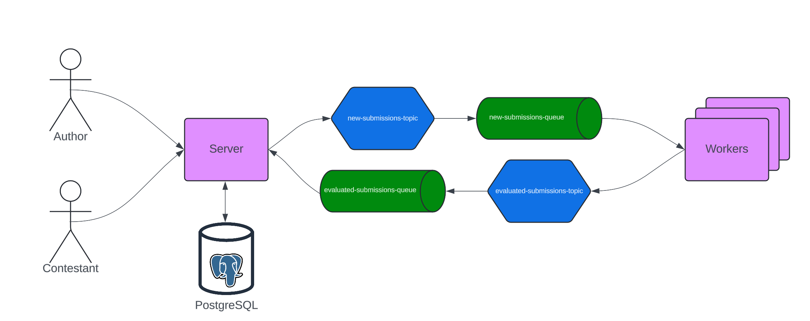
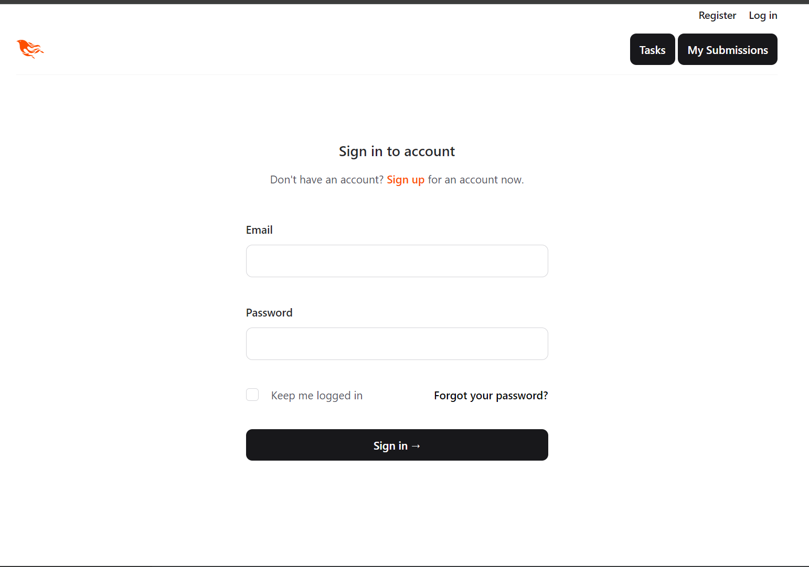
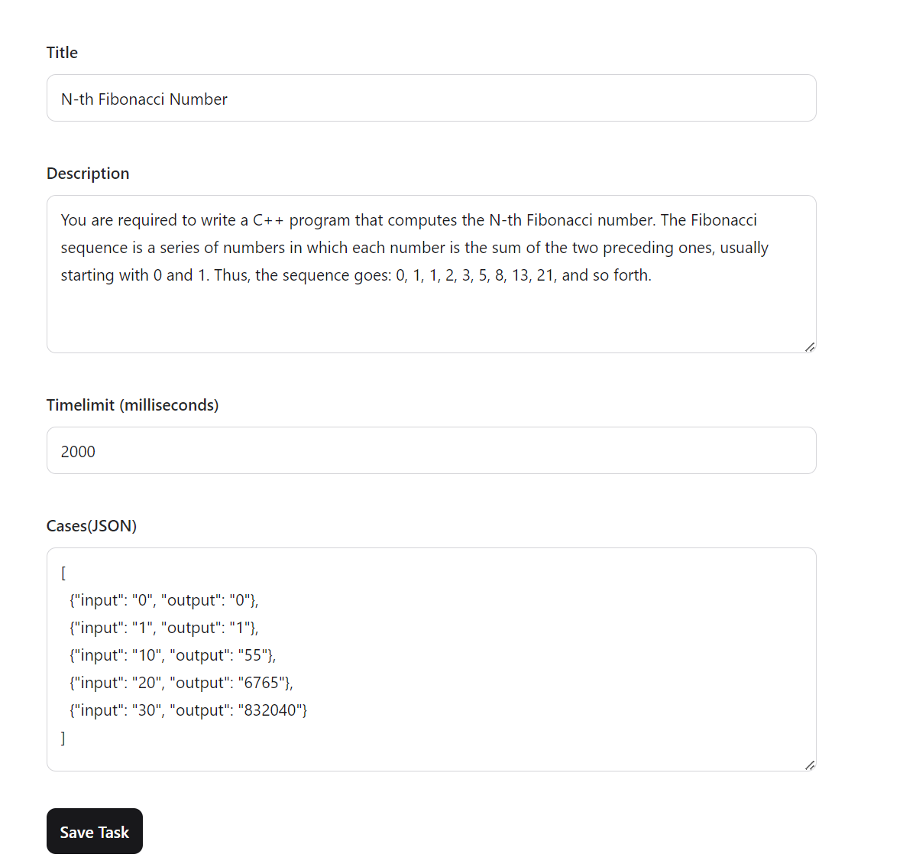
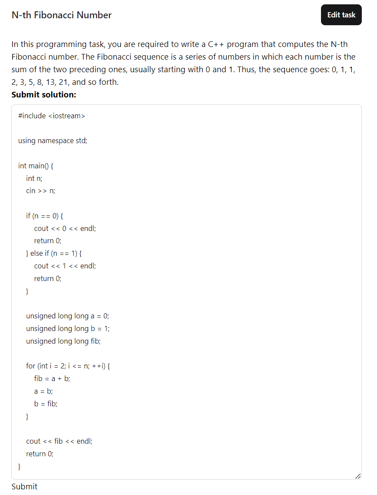
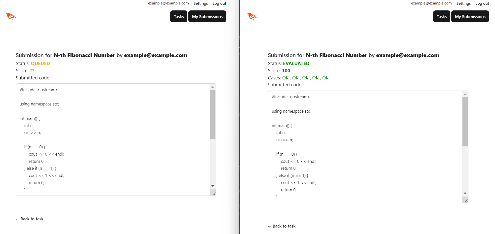
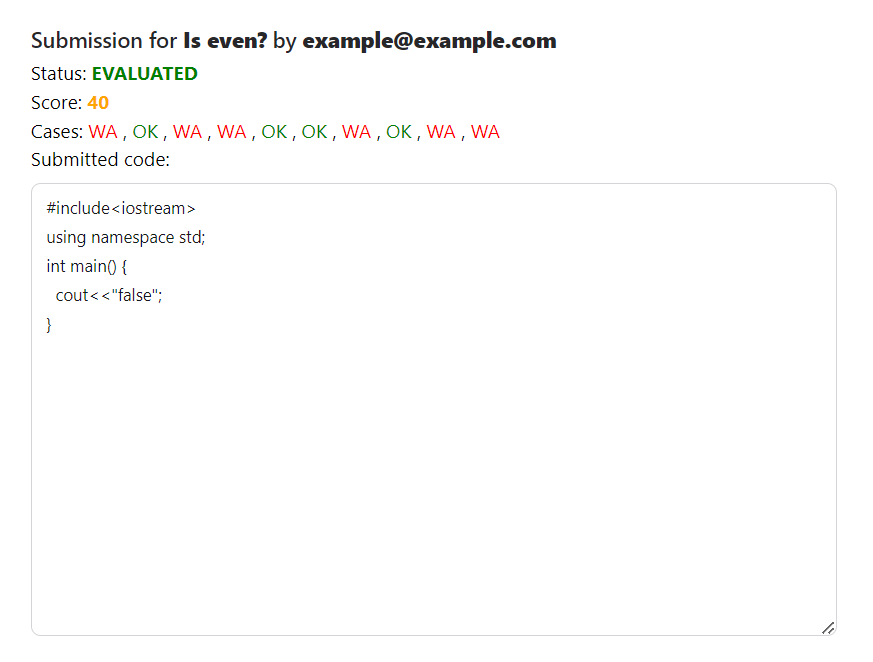
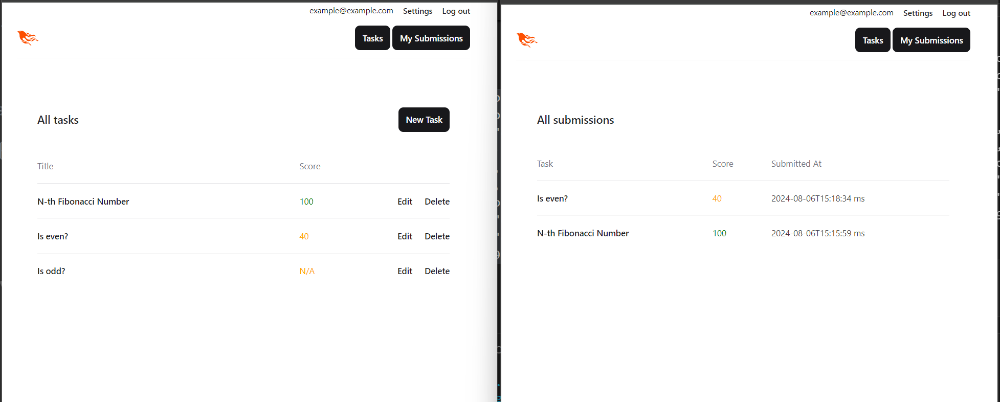

# Introduction
My project for the [Elixir Course](https://elixir-lang.bg/materials/posts) at Sofia University.  
This is a `programming contest judge system`, where authors can create tasks, and contestants can solve them in C++.  
It is a distributed system, consisting of the following components:
- `Server` - an Elixir/Phoenix application that serves the frontend(HTML/JS/CSS), and provides an API for the tasks and submissions.
- `PostgreSQL` - used by the `Server` to persist user info, tasks and submissions.
- `Workers` - separate `Elixir` applications, which accept submissions and evaluate them in an insolaated environment 
- `RabbitMQ` - provides exchanges and queues which decouple the `Server` and the `Workers`



# Flows
## Creating a new task
1. The `Author` logs into the system.
2. They create a new task - providing name, description, test cases and time limit.
3. The `Server` saves the task in `PostgreSQL`.

## Submitting a solution
1. The `Contestant` logs into the system.
2. The `Contestant` chooses a task and writes a solution.
3. The `Server` saves the submission in `PostgreSQL` and emits a message to the `Workers`. (The system doesn't use [Outbox pattern](https://microservices.io/patterns/data/transactional-outbox.html) yet :( ).
4. A free `Worker` takes the message and extracts the source code and the test cases.
5. The `Worker` compiles the code, and executes it for each test case.
6. The `Worker` sends back a message with the results for each test case(OK, Wrong Answer, Time Limit, Compilation Error)
7. The `Server` reads the message and adds the score to the submission in `PostgreSQL`

# Screenshots
## Login

## Creating a new task

## Submitting a solution

## Before and after evaluation

## Partial solution

## Personal dashboards (All tasks and All submissions)


# Run it yourself
```shell
docker-compose up
# open localhost:4000 in your browser
```
