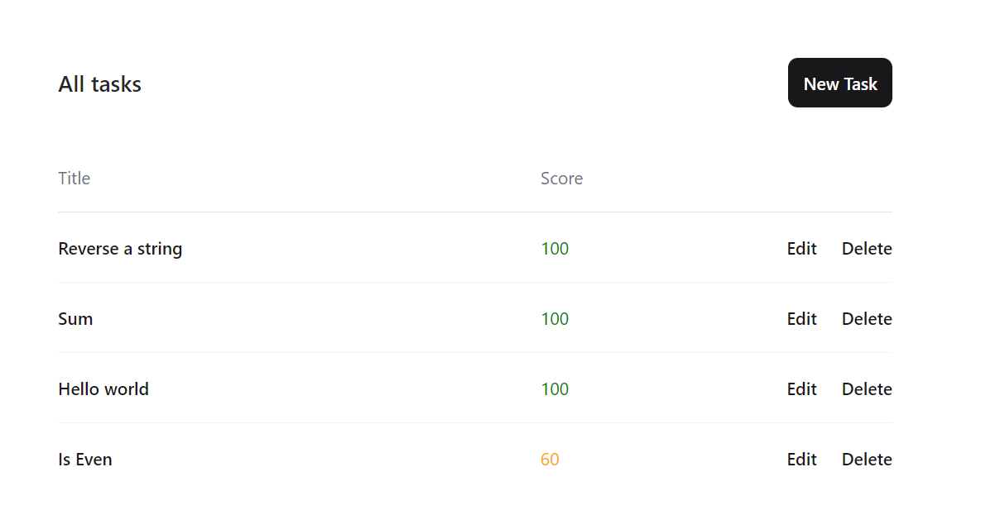
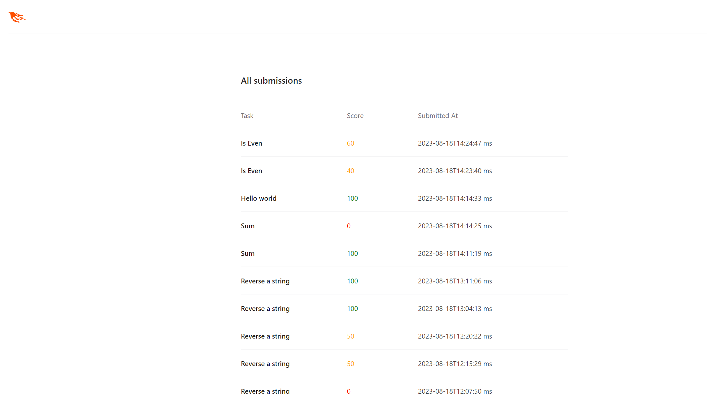
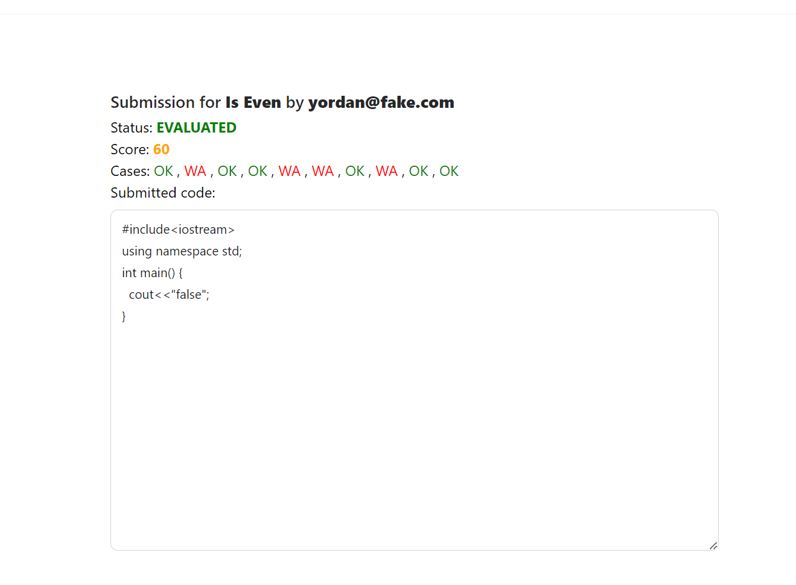

### Sample task
```
Is Odd
```
```
Enter one number, and return "true" or "false" based on its oddness.

Sample input:
5
Sample output:
true
```

```
[
    {"input": "5", "output": "true"},
    {"input": "0", "output": "false"},
    {"input": "-1", "output": "true"},
    {"input": "123", "output": "true"},
    {"input": "1234", "output": "false"},
    {"input": "-120", "output": "false"},
    {"input": "7", "output": "true"},
    {"input": "78", "output": "false"},
    {"input": "87", "output": "true"},
    {"input": "99999999", "output": "true"}
]
```
### Submission
```
#include<iostream>
using namespace std;
int main() {
  cout<<"false";
}
```
```
#include<iostream>
using namespace std;
int main() {
  int n;
  cin>>n;
  cout<<(n % 2 == 0 ? "false" : "true");
}
```


### All tasks

### All submissions

### Random submission

